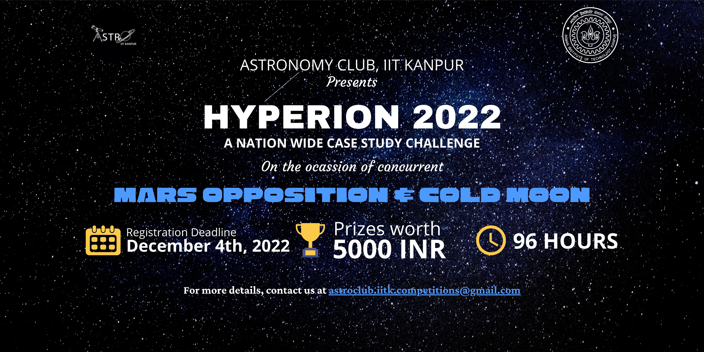

# Hyperion-2022



## Introduction

A case study challenge conducted by Astronomy Club (<a href="https://github.com/astroclubiitk">@astroclubiitk</a>), IIT Kanpur conducted on 5th - 8th December 2022 to mark the ocassion of concurrent Mars Opposition and Cold Moon.

## General Information

```
- The details of the challenge can be found in the Documents folder
```

## Team Members

### Coordinators
```
- Adit Jain
- Atharva Dehadraya
- Nikita Singh
- Shashank Sinha
```

### Secretaries involved
```
- Ashmit Bathla
- Kaustubh Jha
- Ritik B Kumar
- Yogit
```

## COSMOS IS WITHIN US!